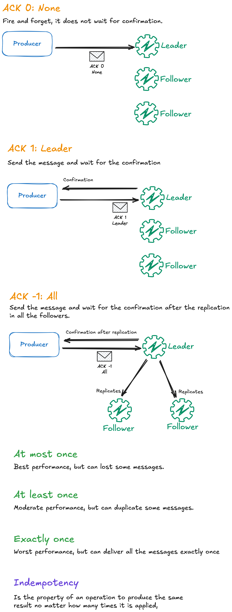

# Apache kafka

#### objetivo
- colocar o conhecimento em pratica

#### configurando ambiente
```
# o que precisa instalar?
- instalar docker

# sem devcontainer
- executar "docker compose up" no terminal

# com devcontainer
- baixar extensão dev container
- abrir dev container
```

#### workflows de teste disponiveis:
- 1: go producer + go consumer + kafka cli
- 2: kafka cli

## 1 - workflow de teste 1: go producer + go consumer + kafka cli

```bash
# como instalar a extensão tools go?
- dev container já traz instalado
- instalar a extensão go
- ctrl + shift + p
- go: install/update tools
- instalar tudo

# workflow teste:
- objetivo:
- consumir topico com dois grupos consumidores ao usar producer go
- grupo 1: goapp-group 
  - consumer goapp
- grupo 2: kafka-cli
  - consumer cli kafka
  - consumer cli kafka

- entrar no container kafka
 docker exec -u 0 -it fc3-apache-kafka-kafka-1 bash

-criar topico
kafka-topics --create --topic teste --bootstrap-server localhost:9092 --partitions 3

- criar consumidor cli kafka
dentro do container kafka ficar consumindo topico com utilitario kafka nativo
kafka-console-consumer --topic teste --bootstrap-server localhost:9092 --group kafka-cli

- entrar no projeto go
docker exec -it gokafka bash

- rodar consumer
go run cmd/consumer/main.go

- rodar producer
go run cmd/producer/main.go

- ver mensagem sendo enviada pelo go producer, e consumidas no kafka e go consumer


# go comandos uteis

- comandos
- gerenciador de pacotes, dependencias
- guarda todas as dependencias externa da aplicação
- go mod

- init gerenciador de depedencias
go mod init

- rodar producer
go run cmd/producer/main.go

- procura dependencias nao baixadas nos arquivos e baixa e adiciona no go mod 
go mod tidy

- arquivo go.sum no go, da um freeze da versao da depedencia que estou usando

```

## 2 - workflow de teste: kafka cli

```bash
# ver conteudo da instancia
docker logs kafka

# rodar ao atualizar dockerfile
docker compose up --build

# entrar no container como root
docker exec -u 0 -it fc3-apache-kafka-kafka-1 bash
  # listar comandos
  ls /usr/bin | grep '^kafka-'
  # executar um utilitario
  kafka-topics

#DENTRO DO KAFKA - WORKFLOW DE TESTE

#qualquer coisa que eu for fazer no kafka vou precisar passar o bootstrap-server

- criar topic
kafka-topics --create --topic teste --bootstrap-server localhost:9092 --partitions 3

- comando: listar topics
- comando: ver descrição do topic

- umas das flags ao conectar consumidor
# cli para isso: kafka-console-consumer
# opcinal: escolher partição especifica
# opcinal: escolher consumer-group
# opcinal: --from-beginning ; por padrão começa o consumidor le das mensagens mais novas, mas com essa opção consigo começar no offset 0

cenario 1: 2 consumer lendo o mesmo topico em grupos separados via cli
- consumer 1: ler topicos em tempo real via cli
kafka-console-consumer --topic test --bootstrap-server localhost:9092
- consumer 2: ler topicos em tempo real via cli
kafka-console-consumer --topic test --bootstrap-server localhost:9092
- producer 1: produzindo mensagem
kafka-console-producer --topic test --bootstrap-server localhost:9092

cenario 2: 2 consumer lendo o mesmo topico no mesmo grupo só que em partições separadas
- consumer 1: ler topicos em tempo real via cli
kafka-console-consumer --bootstrap-server localhost:9092 --topic test --group=x
- consumer 1: ler topicos em tempo real via cli
kafka-console-consumer --bootstrap-server localhost:9092 --topic test --group=x
- producer 1: produzindo mensagem
kafka-console-producer --topic test --bootstrap-server localhost:9092


- ver os consumidores de um grupo
kafka-consumer-groups --bootstrap-server localhost:9092 --group x --describe

- acessar control-center no navegador
localhost:9021

```

## Kafka basics and commands
Prerequisite: make sure the Kafka broker is running and reachable at localhost:9092.

## How to read the diagram (kafka.png)


## Delivery


# Commands

## Topics
- Create a topic (3 partitions):
```shell
kafka-topics --create --topic test --bootstrap-server localhost:9092 --partitions 3
```
- List all topics:
```shell
kafka-topics --list --bootstrap-server localhost:9092
```
- Describe a topic (partitions/replicas/leader):
```shell
kafka-topics --describe --topic test --bootstrap-server localhost:9092
```
- Delete a topic:
```shell
kafka-topics --delete --topic test --bootstrap-server localhost:9092
```

## Console Producer
- Write messages from stdin to a topic. Each line you type is a message:
```shell
kafka-console-producer --topic test --bootstrap-server localhost:9092
```

## Console Consumer
- Read new messages from the tip of the log:
```shell
kafka-console-consumer --topic test --bootstrap-server localhost:9092
```
- Read everything from the beginning of the topic:
```shell
kafka-console-consumer --topic test --bootstrap-server localhost:9092 --from-beginning
```
- Join a consumer group (enables scaling and offset tracking):
```shell
kafka-console-consumer --topic test --bootstrap-server localhost:9092 --group group-x
```

## Consumer Groups
- Describe a group (lags, offsets, assignments). Start at least one consumer in the group first:
```shell
kafka-consumer-groups --bootstrap-server localhost:9092 --group group-x --describe
```